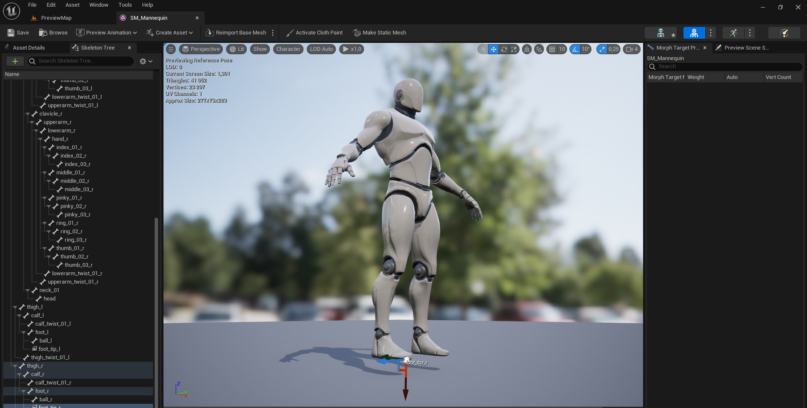

# FreeAnimHelpers
Unreal Engine 5 plugin with some animation helpers.

Currenty, it contains three useful animation helpers.

## Usage

Copy *FreeAnimHelpers* folder to [your project]/Plugins or Engine/Plugins and enable it in Project Settings -> Plugins window.

### SnapFootToGround (Animation Modifier)

Modifier to snap character feet to ground. I use it for turn-in-place animation like [this](https://www.youtube.com/watch?v=TX2gcdWHLpY).

1. Open Skeletal Mesh used in animation you need to modify.

2. For both legs, add tip sockets:
- attached to foot bone;
- located at ball and at the ground, orientation doesn't matter.

3. Open animation sequence asset in Animation Editor, then Animation Data Modifiers window (via Windows menu) and add **SnapFootToGround** modifier.

4. Set *Snap Foot Orientation* checkbox, if you want to make feet horizontal.

5. Fill names of feet bones and tip sockets, then right click and select *Apply Modifier*.

6. Save animation sequence.

### PrepareTurnInPlaceAsset (Animation Modifier)

For my personal specific puropses. You don't need it.

### ResetBonesTranslation (Animation Modifier)

For all bones with "Translation Retargeting Option" = "Skeleton" in the skeleton hierarchy, this modifier changes local translation in animation sequence to skeleton-default. In other words, after thes modifier you can reset "Translation Retargeting Option" for all bones back to "Animation". Useful if you want to export to FBX animation sequence retargeted from another skeleton.

Usage: add modifier to animation sequence, select desired skeletal mesh (to get local translations of bones) and apply it.

### Animate IK Bones

Copy component-space transforms of skeleton bones (usually wrists and feet) to MetaHuman/Mannequin IK bones (ik_foot_r etc).

### Reset Scale of Root Bone

Small function to reset scale of root bone in skeletal mesh and preserve size of the model. See [this video](https://youtu.be/o04BHS8e_M4).

### Distance Curve ModifierEx

Despite the name, currently useful only to add root motion to animation. Root movement should be saved in curves "RootMotion_X",  "RootMotion_Y" and, optionally, "RootMotion_Z".

Required settings in the modifier:
- Root Motion to Curves: unchecked/false
- Root Motion to Root Bone: checked/true
- Root Motion from Curves: checked/true

See [ideo](https://youtu.be/h1-_l7RE4U4).

## To Do

- remove root motion;
- insert T-pose/reference pose in the first frame of animation sequence;
- animate twist bones;
